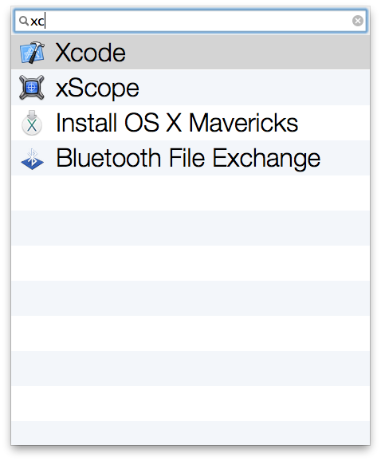
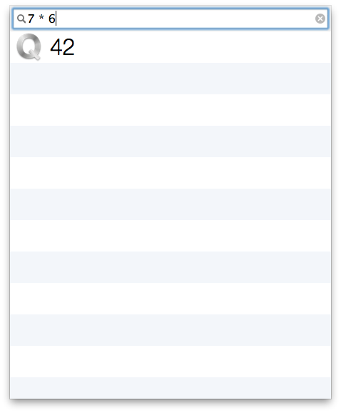

Q is an a perfectly designed gadget [mac app] to perform mission critical tasks quickly. For example, launching apps with just a few keystrokes.

Once open, Q can be activated by pressing control-q.

You can also enter math:

